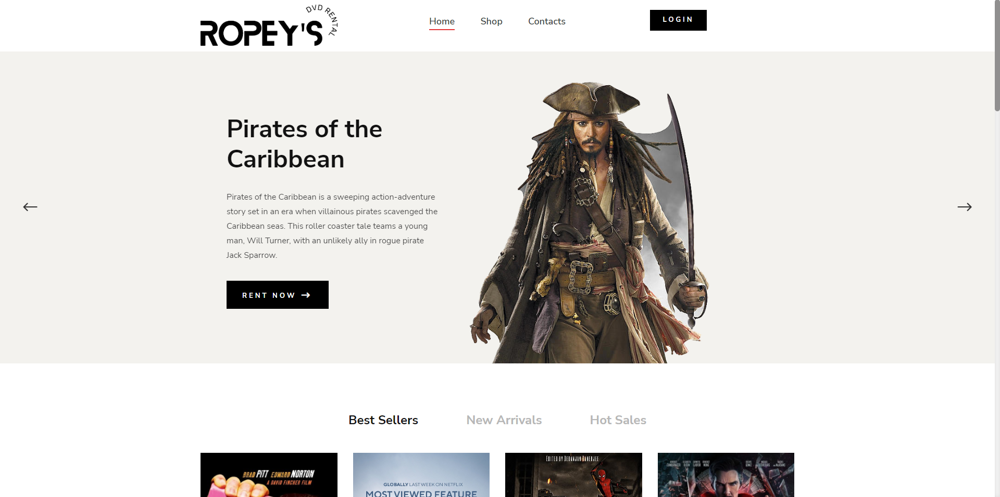
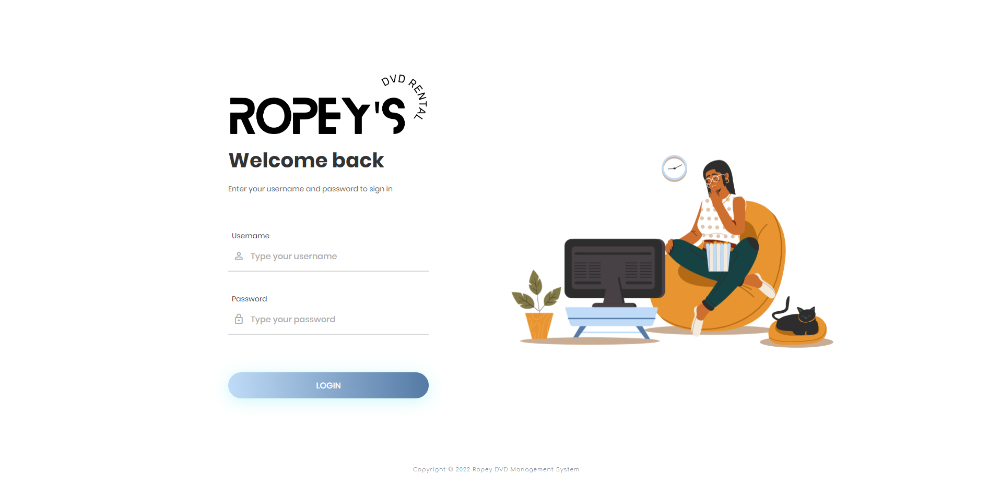
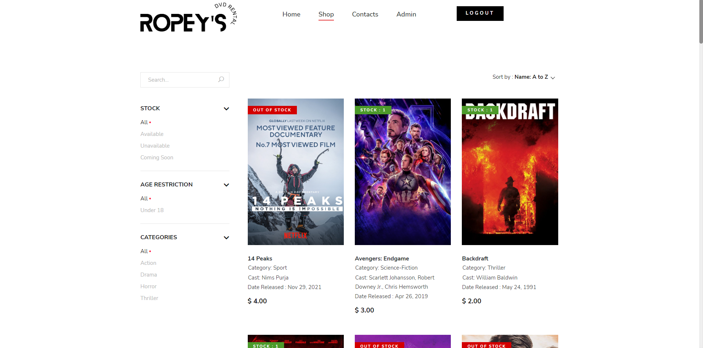
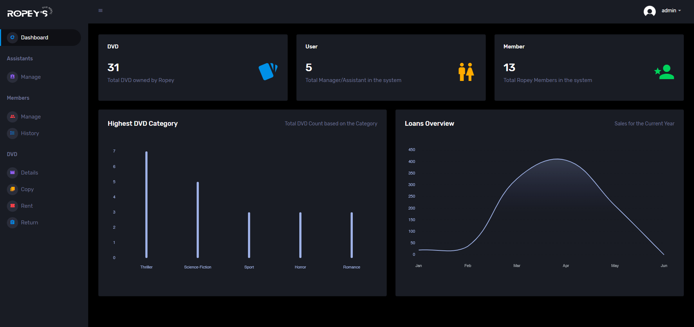
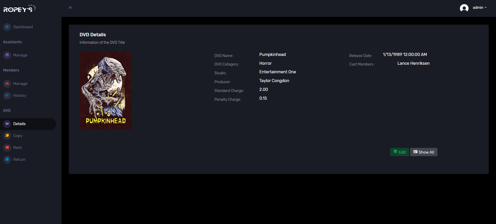
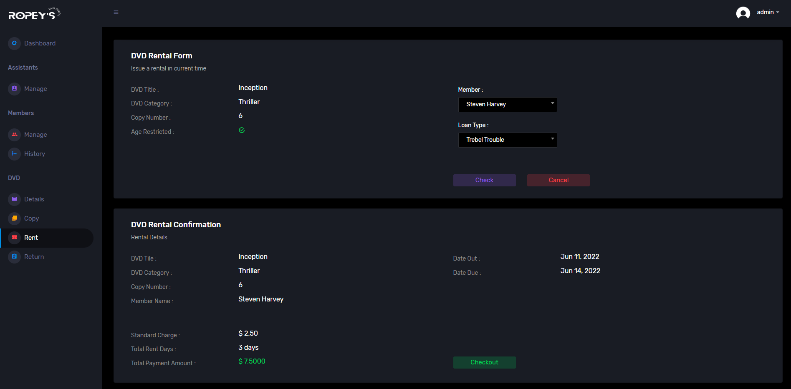

# Ropey DVD Management System

"Application development coursework for creating an application to support the administration of renting and distributing DvDs of Ropey DvD's."

Of course that's what the project started as, a simple assignment for our last year of undergrad. But we had no idea that the project was much more than a simple assignment, and that it would be a flurry of late hours, constant pull requests, work division, and, most importantly, a well working team effort.

  

    

  

    

  

    

  

    

  

    

  

    

  

## Index
- [About](#about)
- [Requirements](#requirements)

  

## About
Ropey DVD Management System is an inventory and rental management system developed in ASP.NET MVC Framework with the aid of the five individuals as part of an assessment. The application's has multiple level of access based on user levell, as well as an interactive user interface to help with the leasing process.

  

## Requirements

- 	The.NET Framework [Ideally V.6 was used] must be installed on the system.
- 	Microsoft SQL Server Management Studio [Ideally 2018 version] must be installed.
-   Before running the application, perform "update-database" in the package console manager.